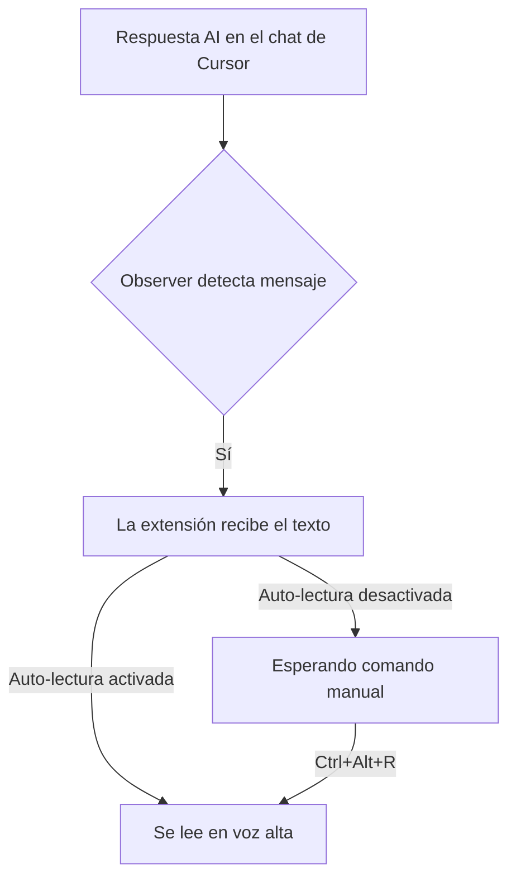

# Cursor AI TTS Extension

¡Convierte las respuestas del chat AI de Cursor en voz de manera automática y productiva!

## 🚀 Características principales
- **Lectura automática y manual** de respuestas AI en Cursor/VS Code.
- **Panel de configuración intuitivo**: elige voz, velocidad, tono y filtrado de código.
- **Atajos de teclado sin conflictos** y personalizables.
- **Feedback visual y auditivo** claro en cada acción.
- **Integración robusta**: no necesitas scripts manuales ni pasos extra.

---

## 🖥️ Instalación

### Desde archivo VSIX
1. Empaqueta la extensión con `npm run package` (o descarga el `.vsix` si ya lo tienes).
2. **Copia el archivo `.vsix` a tu escritorio de Windows** si trabajas en WSL:
   ```bash
   cp /home/tu_usuario/proyectos/cursor-ai-tts/cursor-ai-tts-0.1.0.vsix /mnt/c/Users/tu_usuario/Desktop/
   ```
3. Abre Cursor o VS Code en Windows.
4. Ve a la paleta de comandos (`Ctrl+Shift+P`), busca `Install from VSIX` y selecciona el archivo desde tu escritorio.

### Desde el código fuente
1. Clona este repositorio en tu entorno de desarrollo (WSL recomendado).
2. Ejecuta:
   ```bash
   npm install
   npm run compile
   npm run package
   ```
3. Sigue los pasos anteriores para instalar el `.vsix`.

---

## 🧑‍💻 Uso rápido
- **La extensión leerá automáticamente las respuestas del chat AI** si tienes activada la opción de auto-lectura.
- Puedes abrir el panel de configuración desde la paleta de comandos (`Show Text-to-Speech Settings`).
- Cambia voz, velocidad, tono y filtrado de código desde el panel.

### Comandos disponibles
- `Enable Text-to-Speech for AI Responses`
- `Disable Text-to-Speech for AI Responses`
- `Toggle Auto-Read for AI Responses`
- `Read Last AI Response`
- `Show Text-to-Speech Settings`

### Atajos de teclado (por defecto)
- `Ctrl+Alt+R`: Leer la última respuesta AI
- `Ctrl+Alt+Shift+R`: Alternar auto-lectura

---

## ⚙️ Configuración
- `cursor-ai-tts.enabled`: Activar/desactivar TTS
- `cursor-ai-tts.autoRead`: Lectura automática
- `cursor-ai-tts.voice`: Voz preferida
- `cursor-ai-tts.rate`: Velocidad (0.5 a 2.0)
- `cursor-ai-tts.pitch`: Tono (0.5 a 2.0)
- `cursor-ai-tts.filterCodeBlocks`: Saltar bloques de código

---

## 🧩 ¿Cómo funciona?



---

## ❓ Preguntas frecuentes

**¿Funciona en WSL?**
> Sí, pero debes instalar y empaquetar la extensión desde WSL y luego copiar el `.vsix` a Windows para instalarlo en Cursor/VS Code.

**¿Necesito inyectar scripts manualmente?**
> ¡No! La integración es automática y robusta. El observer se inyecta y comunica solo.

**¿Por qué no escucho nada?**
> - Verifica que tu sistema tiene voces instaladas y el volumen no está en silencio.
> - Abre el panel de configuración y prueba la voz.
> - Asegúrate de que la extensión está habilitada y el panel de TTS abierto.

**¿Puedo cambiar los atajos de teclado?**
> Sí, desde las preferencias de atajos de Cursor/VS Code.

**¿Qué hago si la extensión no detecta respuestas?**
> - Asegúrate de estar usando la última versión.
> - Reinstala la extensión.
> - Si usas WSL, asegúrate de instalar el `.vsix` desde Windows.

---

## 🛠️ Solución de problemas
- **No se instala el `.vsix`**: Copia el archivo a una ruta de Windows antes de instalar.
- **No se lee la respuesta**: Verifica que la extensión esté habilitada y el panel abierto.
- **Errores de voz**: Prueba con otra voz o ajusta la velocidad/tono.

---

## 📝 Notas de versión

### 0.3.0
- Integración automática y robusta con el chat de Cursor.
- Mejor UX en el panel de configuración.
- Feedback visual y auditivo mejorado.
- Código refactorizado y documentado.

### 0.2.0
- Añadida auto-lectura de respuestas AI
- Atajos de teclado mejorados
- Mejoras en la detección de chat

### 0.1.0
- Versión inicial

---

## 📄 Licencia
MIT
